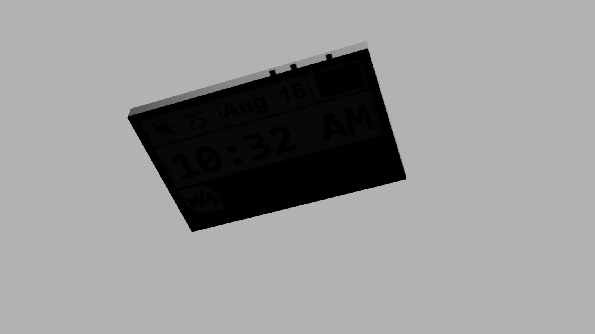

# Openbook - Proiect TSC - by Cosma George

## Block Diagram

## Overview ESP32

1. **GND (All 11 pins)** - Connected to the ground plane
2. **3V3 (Pin 2)** - Connected to the 3.3V power rail
3. **EN (Pin 3)** - Enable pin - activates the ESP32-C6 when power is applied.
4. **IO0 (Pin 8)** - INT_RTC (RTC Interrupt) connects to the RTC module to receive time-based interrupts
5. **IO1 (Pin 9)** - 32KHz clock signal received from Oscilator
6. **IO2 (Pin 27)** - MISO (SPI Master In Slave Out). Connects to External Storage, External I/O and E-Paper Display Header
7. **IO3 (Pin 26)** - EPD_BUSY connects to the E-Paper display's busy signal to monitor when the display is busy
8. **IO4 (Pin 4)** - SS_SD (SD Card Chip Select)
9. **IO5 (Pin 5)** - EPD_DC (E-Paper Display Data/Command) to command the E-Paper Display via the Header
10. **IO6 (Pin 6)** - SCK (SPI Clock) to provide a clock frame of reference to communicate via SPI
11. **IO7 (Pin 7)** - MOSI (SPI Master Out Slave In) Connects to External Storage, External I/O and E-Paper Display Header
12. **IO8 (Pin 10)** - GPIO8 general purpose I/O, connected to a test pad (?)
13. **IO9 (Pin 15)** - IO/BOOT connected to an external push button with pull-up resistors.
14. **I10 (Pin 11)** - EPD_CS (E-Paper Display Chip Select) connects directly to the E-Paper Display Header to select when comunicating/receiving data from it.
15. **IO11 (Pin 11)** - FLASH_CS (SPI Flash Chip Select) connects to the NOR Flash memory to select when communicating/receiving data from it.
16. **IO12 (Pin 12)** - USB_D- (USB Data-) connects directly to the USB-C connector and is used for USB communication via UART.
17. **IO13 (Pin 13)** - USB_D+ (USB Data+) connects directly to the USB-C connector and is used for USB communication via UART.
18. **IO15 (Pin 14)** - IO/CHANGE connected to a push button with pull-up resistors, for user input
19. **TXD0/GPIO16 (Pin 25)** - TX (UART Transmit) connected to test pads - for debugging or programming
20. **RXD0/GPIO17 (Pin 24)** - RX (UART Receive) connected to test pads - for debugging or programming
21. **IO18 (Pin 16)** - RTC_RST (RTC Reset) connects to the reset pin of the real-time clock module
22. **IO19 (Pin 17)** - I2C_PW (I2C Power control) controls power to the I2C peripherals
23. **IO20 (Pin 18)** - EPD_3V3_C (E-Paper Display 3.3V control) controls power to the E-Paper display via a transistor. Used to turn on/off the display to save power when not in use.
24. **IO21 (Pin 19)** - SDA (I2C Data) connects to the I2C peripherals for data communication
25. **IO22 (Pin 20)** - SCL (I2C Clock) connects to the I2C peripherals for clock signal
26. **IO23 (Pin 21)** - EPD_RST (E-Paper Display Reset) connects to the E-Paper display's reset pin to reset the display when needed

## Components overview

1. **ESP32-C6-WROOM-1-N8**
   - Purpose: Main microcontroller/SoC
   - Interfaces: Everything
2. **W25Q512JVEIQ**
   - Purpose: External NOR flash memory
   - Interface: SPI
3. **MAX17048G+T10**
   - Purpose: IC to monitor Li-Po battery level
   - Interface: I2C
4. **XC6220A331MR-G**
   - Purpose: LDO voltage regulator
   - Interface: None (power supply)
5. **USBLC6-2SC6Y**
   - Purpose: USB ESD protection IC
   - Interface: USB D+/D- UART lines
6. **MCP73831**
   - Purpose: Single-cell Li-Po battery charging controller
   - Interface: None (power supply)
7. **BME688**
   - Purpose: Environmental sensor
   - Interface: I2C
8. **BD5229G-TR + Buttons**
   - Purpose: Voltage supervisor + Buttons
   - Interface: GPIO
9. **DS3231SN**
   - Purpose: Real-time clock with crystal oscillator
   - Interface: I2C and GPIO
10. **112A-TAAR-R03_ATTEND**
    - Purpose: SD card slot for storage
    - Interface: SPI
11. **FH34SRJ-24S-0.5SH_99_**
    - Purpose: E-Paper Display Headder
    - Interface: SPI + GPIO
12. **SAMACSYS_PARTS_USB4110-GF-A**
    - Purpose: USB-C connector
    - Interface: USB D+/D- UART

## Bill of Materials

| Qty | Device                       | Value                                    | Parts                                                                                                       | Description                                                                                                                   | BUY                                                                                                                                | DATASHEET                                                                                                                             |
|-----|------------------------------|------------------------------------------|-------------------------------------------------------------------------------------------------------------|-------------------------------------------------------------------------------------------------------------------------------|------------------------------------------------------------------------------------------------------------------------------------|---------------------------------------------------------------------------------------------------------------------------------------|
| 1   | 112A-TAAR-R03_ATTEND         | -                                        | J4                                                                                                          | Micro SD Card Socket, Push-Push Type, Top Mount,   SMT, H=1.83mm, 10u                                                         | [Buy here](https://www.tme.eu/ro/details/mcc-sdmicro/conectori-pentru-cartele/attend/112a-taar-r03/)                                           | [Datasheet here](https://cdn.soselectronic.com/productdata/bd/ac/42954337/112a-taar-r03.pdf)                                                            |
| 1   | 744043680IND_4828-WE-TPC_WRE | 68uH                                     | L1                                                                                                          |                                                                                                                               | [Buy here](https://ro.mouser.com/ProductDetail/Wurth-Elektronik/744043008?qs=PGXP4M47uW6hG5GeMvqOSQ%3D%3D)                                     | [Datasheet here](https://www.we-online.com/components/products/datasheet/744043008.pdf)                                                                 |
| 1   | ADAFRUIT_LEDCHIP-LED0603     | -                                        | CHG_LED                                                                                                     | LED                                                                                                                           | [Buy here](https://ro.mouser.com/ProductDetail/ROHM-Semiconductor/CSL1104WBBW1?qs=DRkmTr78QAQ%252BqzFWy9Kqog%3D%3D)                            | [Datasheet here](https://fscdn.rohm.com/en/products/databook/datasheet/opto/led/chip_mono/csl1104wbbw1-e.pdf)                                           |
| 2   | AVX SD0805S020S1R0           | -                                        | D2, D7                                                                                                      | Schottky Barrier Rectifier   Diode                                                                                            | [Buy here](https://ro.mouser.com/ProductDetail/KYOCERA-AVX/SD0805S020S1R0?qs=jCA%252BPfw4LHbpkAoSnwrdjw%3D%3D)                                 | [Datasheet here](https://ro.mouser.com/datasheet/2/40/schottky-3165252.pdf)                                                                             |
| 1   | BD5229G-TR                   | -                                        | IC1                                                                                                         | Voltage Detector with Adjustable Delay Time                                                                                   | [Buy here](https://ro.mouser.com/ProductDetail/ROHM-Semiconductor/BD5229G-TR?qs=4kLU8WoGk0vvnhrrYwdszw%3D%3D)                                  | [Datasheet here](https://fscdn.rohm.com/en/products/databook/datasheet/ic/power/voltage_detector/bd52xxg-e.pdf)                                         |
| 1   | BME688                       | -                                        | SENSOR2                                                                                                     | Integrated Environmental   Unit                                                                                               | [Buy here](https://ro.mouser.com/ProductDetail/Bosch-Sensortec/BME688?qs=IS%252B4QmGtzzqQoVDscqwx3A%3D%3D)                                     | [Datasheet here](https://ro.mouser.com/datasheet/2/783/bst_bme688_fl000-2307034.pdf)                                                                    |
| 1   | Button                       | BOOT_BUTTON, CHANGE_BUTTON_ RESET_BUTTON | U$1, U$2, U$3                                                                                               |                                                                                                                               | [Buy here](https://ro.mouser.com/ProductDetail/Panasonic/EVQ-9P701P?qs=NPkb10g2yLBKCwpELvsGNg%3D%3D)                                           | [Datasheet here](https://4donline.ihs.com/images/VipMasterIC/IC/PANA/PANAS45028/PANAS45028-1.pdf?hkey=CECEF36DEECDED6468708AAF2E19C0C6)                 |
| 1   | Capacitor                    | 0.1uF/50V                                | EPD_C5                                                                                                      | CAPACITOR, European symbol                                                                                                    | [Buy here](https://ro.mouser.com/ProductDetail/WIMA/SMDIC03100KA00MP00?qs=sGAEpiMZZMukHu%252BjC5l7YTpCIjlvjqqOhx6cMTURzRs%3D)                  | [Datasheet here](https://ro.mouser.com/datasheet/2/440/e_WIMA_SMD_PPS-1139945.pdf)                                                                      |
| 8   | Capacitor                    | 100nF                                    | C1, C2, C4_USB, C6, C8, C9, C10, C_DELAY                                                                    | CAPACITOR, European symbol                                                                                                    | [Buy here](https://ro.mouser.com/ProductDetail/Vishay-Vitramon/VJ1210Y104KBBAT4X?qs=sGAEpiMZZMukHu%252BjC5l7YUsqw7r0AP18aXzCLTFnl8Y%3D)        | [Datasheet here](https://www.vishay.com/doc?45198)                                                                                                      |
| 1   | Capacitor                    | 10uF                                     | C7                                                                                                          | CAPACITOR, European symbol                                                                                                    | [Buy here](https://ro.mouser.com/ProductDetail/KYOCERA-AVX/KGM03DS60E106MH?qs=sGAEpiMZZMukHu%252BjC5l7YWACoop%252BoD4TOu1wAFQEK4E%3D)          | [Datasheet here](https://ro.mouser.com/datasheet/2/40/cx5r_KGM-3223198.pdf)                                                                             |
| 1   | Capacitor                    | 1uF                                      | C5                                                                                                          | CAPACITOR, European symbol                                                                                                    | [Buy here](https://ro.mouser.com/ProductDetail/WIMA/SMDTC04100VA00KR00?qs=sGAEpiMZZMukHu%252BjC5l7YeyzaTQ4jBxXydaOoMKRkJQ%3D)                  | [Datasheet here](https://ro.mouser.com/datasheet/2/440/e_WIMA_SMD_PET-1139826.pdf)                                                                      |
| 9   | Capacitor                    | 1uF/50V                                  | EPD_C1, EPD_C2, EPD_C6,   EPD_C7, EPD_C8, EPD_C9, EPD_C10, EPD_C11, EPD_C12                                 | CAPACITOR, European symbol                                                                                                    | [Buy here](https://ro.mouser.com/ProductDetail/WIMA/SMDTC04100VA00KR00?qs=sGAEpiMZZMukHu%252BjC5l7YeyzaTQ4jBxXydaOoMKRkJQ%3D)                  | [Datasheet here](https://ro.mouser.com/datasheet/2/440/e_WIMA_SMD_PET-1139826.pdf)                                                                      |
| 5   | Capacitor                    | 4.7uF                                    | C1_BAT, C1_BAT1, C1_BAT2, C2_BAT, C5_USB                                                                    | CAPACITOR, European symbol                                                                                                    | [Buy here](https://ro.mouser.com/ProductDetail/WIMA/SMDTD04470YA00KS00?qs=sGAEpiMZZMukHu%252BjC5l7YTpCIjlvjqqOpdXtMIjonJE%3D)                  | [Datasheet here](https://ro.mouser.com/datasheet/2/440/e_WIMA_SMD_PET-1139826.pdf)                                                                      |
| 1   | Capacitor                    | 4.7uF/25V                                | C4                                                                                                          | CAPACITOR, European symbol                                                                                                    | [Buy here](https://ro.mouser.com/ProductDetail/WIMA/SMDTD04470YA00KS00?qs=sGAEpiMZZMukHu%252BjC5l7YTpCIjlvjqqOpdXtMIjonJE%3D)                  | [Datasheet here](https://ro.mouser.com/datasheet/2/440/e_WIMA_SMD_PET-1139826.pdf)                                                                      |
| 1   | CPH3225A                     | -                                        | C10_SUPERCAP                                                                                                | Cap 0.011F 3.3V 1210 Flat Check availability                                                                                  | [Buy here](https://ro.mouser.com/ProductDetail/Seiko-Semiconductors/CPH3225A?qs=3etwrb1wR%252BhUOph6lAO7eg%3D%3D)                              | [Datasheet here](https://ro.mouser.com/datasheet/2/360/Seiko_Instruments_MicroBattery_E_20230330_2024Jan_-3561061.pdf)                                  |
| 2   | DMG2305UX-7                  | 20V/4.2A/52mO/1.4W                       | Q1, Q2                                                                                                      | P-channel MOSFETs                                                                                                             | [Buy here](https://ro.mouser.com/ProductDetail/Diodes-Incorporated/DMG2305UX-7?qs=L1DZKBg7t5F%2FNBHrjfxC%252Bg%3D%3D)                          | [Datasheet here](https://www.diodes.com/assets/Datasheets/DMG2305UX.pdf)                                                                                |
| 1   | DS3231SN#                    | -                                        | U3                                                                                                          | Real Time Clock Serial 16-Pin SOIC W T/R     Check availability                                                               | [Buy here](https://ro.mouser.com/ProductDetail/Analog-Devices-Maxim-Integrated/DS3231SN?qs=1eQvB6Dk1vhUlr8%2FOrV0Fw%3D%3D)                     | [Datasheet here](https://ro.mouser.com/datasheet/2/609/DS3231-3421123.pdf)                                                                              |
| 1   | ESP32-C6-WROOM-1-N8          | -                                        | U2                                                                                                          |                                                                                                                               | [Buy here](https://ro.mouser.com/ProductDetail/Espressif-Systems/ESP32-C6-WROOM-1-N8?qs=8Wlm6%252BaMh8ST02Gmwp74cw%3D%3D)                      | [Datasheet here](https://ro.mouser.com/datasheet/2/891/Espressif_ESP32_C6_WROOM_1__Datasheet_V0_1_PRELIMI-3239987.pdf)                                  |
| 1   | FH34SRJ-24S-0.5SH_99_        | -                                        | J1                                                                                                          |  (0.50mm)   Surface Mount, Right Angle                                                                                        | [Buy here](https://ro.mouser.com/ProductDetail/Hirose-Connector/FH34SRJ-24S-0.5SH99?qs=vcbW%252B4%252BSTIpKBl5ap9J8Fw%3D%3D)                   | [Datasheet here](https://ro.mouser.com/datasheet/2/185/FH34SRJ_24S_0_5SH_99__CL0580_1255_6_99_2DDrawing_0-1615044.pdf)                                  |
| 1   | MAX17048G+T10                | -                                        | U4                                                                                                          |                                                                                                                               | [Buy here](https://ro.mouser.com/ProductDetail/Analog-Devices-Maxim-Integrated/MAX17048G%2bT10?qs=D7PJwyCwLAoGnnn8jEPRBQ%3D%3D)                | [Datasheet here](https://ro.mouser.com/datasheet/2/609/MAX17048_MAX17049-3469099.pdf)                                                                   |
| 3   | MBR0530                      | -                                        | D3, D4, D5                                                                                                  | ON SEMICONDUCTOR - MBR0530 - DIODE, SCHOTTKY, 0.5A,   30V, SOD-123                                                            | [Buy here](https://ro.mouser.com/ProductDetail/onsemi/MBR0530T3G?qs=3JMERSakebpEmdUS6GetdQ%3D%3D)                                              | [Datasheet here](https://www.onsemi.com/PowerSolutions/product.do?id=MBR0530T3G)                                                                        |
| 1   | MCP73831                     | -                                        | U10                                                                                                         | MCP73831T Li-Ion, Li-Pol   Controller                                                                                         | [Buy here](https://ro.mouser.com/ProductDetail/Microchip-Technology/MCP73831T-2ACI-OT?qs=yUQqVecv4qvbBQBGbHx0Mw%3D%3D)                         | [Datasheet here](https://ro.mouser.com/datasheet/2/268/MCP73831_Family_Data_Sheet_DS20001984H-3441711.pdf)                                              |
| 6   | PGB1010603MR                 | -                                        | D6, D8, D9, D10, D11, D12                                                                                   |                                                                                                                               | [Buy here](https://ro.mouser.com/ProductDetail/Littelfuse/PGB1010603MR?qs=gu7KAQ731URLg4GSnNNN7Q%3D%3D)                                        | [Datasheet here](https://www.littelfuse.com/assetdocs/pulseguard-esd-suppressors-pgb1-datasheet?assetguid=8a337998-d54d-466b-be4e-dc5bcd1f9321)         |
| 1   | QWIIC_CONNECTORJS-1MM        | -                                        | J3                                                                                                          | SparkFun I2C Standard   Qwiic Connector                                                                                       | [Buy here](https://www.sparkfun.com/qwiic-jst-connector-smd-4-pin-horizontal.html)                                                             | [Datasheet here](https://cdn.sparkfun.com/assets/parts/1/2/2/8/9/Qwiic_Connector_Datasheet.pdf)                                                         |
| 1   | RCL_CPOL-EUCT3528            | 100uF TANT                               | C3                                                                                                          | POLARIZED CAPACITOR, European symbol                                                                                          | [Buy here](https://ro.mouser.com/ProductDetail/Vishay-Sprague/593D107X9020E2TE3?qs=sGAEpiMZZMsh%252B1woXyUXj7FzGMN%252BX%252BZrA47dYxLY0LY%3D) | [Datasheet here](https://www.vishay.com/doc?40005)                                                                                                      |
| 1   | Resistance                   | 0.47                                     | R3                                                                                                          | RESISTOR, European symbol                                                                                                     | [Buy here](https://ro.mouser.com/ProductDetail/Panasonic/ERJ-14BQFR47U?qs=sGAEpiMZZMukHu%252BjC5l7Ye4WQ9FrfA3YXh5QopT%252BLe8%3D)              | [Datasheet here](https://industrial.panasonic.com/cdbs/www-data/pdf/RDN0000/AOA0000C313.pdf)                                                            |
| 1   | Resistance                   | 100K                                     | R1_PWRBUS                                                                                                   | RESISTOR, European symbol                                                                                                     | [Buy here](https://ro.mouser.com/ProductDetail/Vishay-Thin-Film/PTN0603E1003BBT1?qs=sGAEpiMZZMukHu%252BjC5l7YTJuwIl8JpxyJ2Y%2FdokIqGc%3D)      | [Datasheet here](https://www.vishay.com/doc?60026)                                                                                                      |
| 16  | Resistance                   | 10K                                      | R1, R1_PINH, R1_PINH1,   R2_PINH, R2_PINH1, R4, R5, R6, R7, R8, R9, R10, R_BOOT, R_CHANGE, R_CL1,   R_RESET | RESISTOR, European symbol                                                                                                     | [Buy here](https://ro.mouser.com/ProductDetail/Vishay-Draloric/RCA040210K0JNED?qs=sGAEpiMZZMukHu%252BjC5l7YQO3gf4mVmUu96cUBYHYfeM%3D)          | [Datasheet here](https://www.vishay.com/doc?20037)                                                                                                      |
| 1   | Resistance                   | 15                                       | R_CAPACITOR                                                                                                 | RESISTOR, European symbol                                                                                                     | [Buy here](https://ro.mouser.com/ProductDetail/ROHM-Semiconductor/KTR03EZPJ150?qs=sGAEpiMZZMtlubZbdhIBICz%2FtfrlArmddJ1cOrAnKnc%3D)            | [Datasheet here](https://www.rohm.com/datasheet?p=KTR03EZPJ&dist=Mouser&media=referral&source=mouser.com&campaign=Mouser)                               |
| 1   | Resistance                   | 2.2                                      | R2                                                                                                          | RESISTOR, European symbol                                                                                                     | [Buy here](https://ro.mouser.com/ProductDetail/ROHM-Semiconductor/KTR18EZPJ2R2?qs=sGAEpiMZZMtlubZbdhIBICz%2FtfrlArmdtqB%2FNN1ZHWQ%3D)          | [Datasheet here](https://www.rohm.com/datasheet?p=KTR18EZPJ&dist=Mouser&media=referral&source=mouser.com&campaign=Mouser)                               |
| 1   | Resistance                   | 200                                      | R1_BAT                                                                                                      | RESISTOR, European symbol                                                                                                     | [Buy here](https://ro.mouser.com/ProductDetail/ROHM-Semiconductor/KTR10EZPJ201?qs=sGAEpiMZZMtlubZbdhIBIGrVcSH3vih40FduZYz%252BzpI%3D)          | [Datasheet here](https://www.rohm.com/datasheet?p=KTR10EZPJ&dist=Mouser&media=referral&source=mouser.com&campaign=Mouser)                               |
| 1   | Resistance                   | 2K                                       | R2_BAT                                                                                                      | RESISTOR, European symbol                                                                                                     | [Buy here](https://ro.mouser.com/ProductDetail/Vishay-Sfernice/P0805Y2001BBW?qs=sGAEpiMZZMtlubZbdhIBIL5MhBxehHgV0bOCcoqDPYA%3D)                | [Datasheet here](https://4donline.ihs.com/images/VipMasterIC/IC/VISH/VISH-S-A0007087424/VISH-S-A0007087424-1.pdf?hkey=CECEF36DEECDED6468708AAF2E19C0C6) |
| 2   | Resistance                   | 5K1                                      | R2-USB, R2-USB1                                                                                             | RESISTOR, European symbol                                                                                                     | [Buy here](https://ro.mouser.com/ProductDetail/Vishay-Dale/TNPW04025K10BYEP?qs=sGAEpiMZZMtlubZbdhIBIJ2VesJ5mRFWaQfYu47si8Y%3D)                 | [Datasheet here](https://www.vishay.com/doc?28758)                                                                                                      |
| 1   | SAMACSYS_PARTS_USB4110-GF-A  | -                                        | J2                                                                                                          | CONN USB 2.0 TYPE-C R/A   SMT                                                                                                 | [Buy here](https://ro.mouser.com/ProductDetail/GCT/USB4110-GF-A?qs=KUoIvG%2F9IlYiZvIXQjyJeA%3D%3D)                                             | [Datasheet here](https://ro.mouser.com/datasheet/2/837/GCT_USB4110_Product_Drawing___20k_cycles-3455479.pdf)                                            |
| 1   | SI1308EDL-T1-GE3             | -                                        | Q3                                                                                                          | MOSFET N-Ch 30V 1.5A TrenchFET SC70 Vishay   Si1308EDL-T1-GE3 N-channel MOSFET Transistor, 1.5 A, 30 V, 3-Pin SC-70           | [Buy here](https://ro.mouser.com/ProductDetail/Vishay-Semiconductors/SI1308EDL-T1-GE3?qs=bX1%252BNvsK%2FBramh9tgpOaEw%3D%3D)                   | [Datasheet here](https://www.vishay.com/doc?63399)                                                                                                      |
| 1   | USBLC6-2SC6Y                 | -                                        | D1                                                                                                          | Low Cap. ESD Protection   Auto SOT-23-6 STMicroelectronics USBLC6-2SC6Y, Dual Uni-Directional TVS Diode   Array, 6-Pin SOT-23 | [Buy here](https://ro.mouser.com/ProductDetail/STMicroelectronics/USBLC6-2SC6Y?qs=gNDSiZmRJS%2FOgDexvXkdow%3D%3D)                              | [Datasheet here](https://ro.mouser.com/datasheet/2/389/usblc6_2sc6y-1852505.pdf)                                                                        |
| 1   | VARISTOR CN1812              | -                                        | PFMF.050.1                                                                                                  | VARISTOR                                                                                                                      | [Buy here](https://ro.mouser.com/ProductDetail/Schurter/PFMF.050.2?qs=1auRipcfynCums5v1iucSA%3D%3D)                                            | [Datasheet here](https://ro.mouser.com/datasheet/2/358/typ_PFMF-1275918.pdf)                                                                            |
| 1   | W25Q512JVEIQ                 | -                                        | U1                                                                                                          |                                                                                                                               | [Buy here](https://ro.mouser.com/ProductDetail/Winbond/W25Q512JVEIQ?qs=l7cgNqFNU1jw6svr3at6tA%3D%3D)                                           | [Datasheet here](https://ro.mouser.com/datasheet/2/949/Winbond_W25Q512JV_Datasheet-3240039.pdf)                                                         |
| 1   | XC6220A331MR-G               | -                                        | IC4                                                                                                         | LDO Voltage Regulators                                                                                                        | [Buy here](https://ro.mouser.com/ProductDetail/Torex-Semiconductor/XC6220A331MR-G?qs=AsjdqWjXhJ8ZSWznL1J0gg%3D%3D)                             | [Datasheet here](https://ro.mouser.com/datasheet/2/760/xc6220-3371556.pdf)                                                                              |
| 1   | Battery                      | -                                        | -                                                                                                           | CELLEVIA BATTERIES LP584174, 3.7V 1800 mAh | [Buy here](https://www.tme.eu/ro/details/accu-lp584174_cl/acumulatori/cellevia-batteries/l584174/) | [Datasheet here](https://www.tme.eu/Document/e0683d8c34e6d878124489f71bffb6ee/cel0014.pdf) |
| 1   | E-Paper Display              | -                                        | -                                                                                                           | 7.5''  800x480 px 125 DPI | [Buy here](https://www.waveshare.com/7.5inch-e-paper-hat.htm) | [Datasheet here](https://files.waveshare.com/upload/6/60/7.5inch_e-Paper_V2_Specification.pdf) |

## Implementation Notes/Details

- I've attempted to replicate the schematic as closely as possible, but there might be minor differences in terms of label size, label and text positioning,
compactness of components.
- The PCB was routed 100% manually, with no auto-router used. Both a top and bottom ground plane were used, as per the design requirements, and extensive via stitching was used to ensure a low-impedance ground connection. Via stiching can be removed if design parameters change, as additional vias for ground connectivity have been added to the design outside of the stiching process.
- Two visas were used for I2C_PW line, as it was unavoidable to route without crossing another power line. All power lines were routed using 0.3mm without vias and kept as short as possible, and all signal lines were routed using 0.2mm using vias.  
- PCB Thickness was modified to 1mm to ensure it, alongside the display, were able to fit within the given enclosure.
- PCB holes were added for the battery, ESP antenna, and the display header to allow for the ribbon cable to be inserted.
- Silkscreen was made with minimality in mind. Additional marks (lines, extra text) were added when needed to ensure readability.
- Accepted clearence error for USB-C connector.

## Other Images

